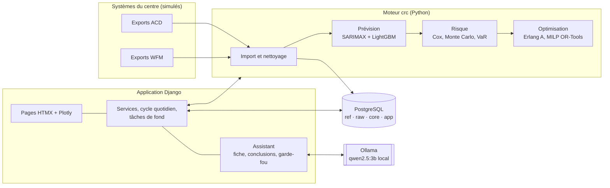

# Pilote CRC — Plateforme intelligente de prévision, d'optimisation et de gestion des risques pour centres de relation client

Projet de fin d'année (PFA) de 4e année ingénieur — ESPRIT / IMT Mines Albi.
**Auteur :** _à compléter_

Pilote CRC répond chaque jour à une question simple : **combien d'agents faut-il, à quel moment, pour un coût minimal et un risque maîtrisé ?**
Elle prévoit la demande avec son incertitude, chiffre le risque opérationnel en euros, construit le planning optimal en vacations réelles,
puis accompagne le manager dans sa décision : alertes, simulations what-if, historique, capacité à long terme et assistant IA.

---

## Sommaire

1. [Ce que fait la plateforme](#1-ce-que-fait-la-plateforme)
2. [Résultats clés](#2-résultats-clés)
3. [Architecture](#3-architecture)
4. [Installation locale (Windows)](#4-installation-locale-windows)
5. [Installation avec Docker](#5-installation-avec-docker)
6. [Scénario de démonstration](#6-scénario-de-démonstration)
7. [Commandes de référence](#7-commandes-de-référence)
8. [Tests](#8-tests)
9. [Structure du dépôt](#9-structure-du-dépôt)
10. [Choix, limites et perspectives](#10-choix-limites-et-perspectives)

---

## 1. Ce que fait la plateforme

**Le cycle quotidien.** Chaque nuit, la plateforme reçoit les exports de la veille (distributeur d'appels, outil de gestion des effectifs),
les nettoie, les compare à ce qu'elle avait prévu (détection d'anomalies), se réentraîne le 1er du mois, puis prépare le lendemain :
prévision, planning recommandé en vacations, risque et alertes.

| Page | Pour qui | Ce qu'on y fait |
|---|---|---|
| **Accueil** | tous | Journée planifiée, coût attendu, alertes, avancement du cycle quotidien |
| **Prévision** | tous | Prévision à J+1, fourchettes à 80 % et 98 %, anomalies, explication de chaque demi-heure (SHAP) |
| **Capacité** | tous | Effectif (ETP) et budget à 1, 2, 3 ou 4 ans, avec la fiabilité mesurée selon l'horizon |
| **Planning** | tous | Besoin, couverture, vacations en Gantt, ajustement avec recalcul du risque, validation, exports Excel et PDF |
| **Risque** | tous | Perte attendue, VaR, Expected Shortfall, distribution des pertes, fiabilité de la VaR en exploitation |
| **What-if** | tous | Volume, absences, budget, risque toléré : conséquences chiffrées, transformation en planning |
| **Alertes** | tous | Alertes graduées, prise en compte, résolution, recalcul automatique à la publication d'un planning |
| **Historique** | tous | Prévu vs réalisé, gain des décisions, gain potentiel des recommandations |
| **Assistant IA** | tous | Questions en français, réponses fondées sur les chiffres de la plateforme, vérifiées |
| **Paramètres** | administrateur | Coûts, seuils, risque toléré, règles de vacations, avec historique |
| **Modèles** | administrateur | Performance en exploitation, détection de dérive, réentraînement, retour arrière |
| **Utilisateurs** | administrateur | Comptes, rôles, mots de passe provisoires |

**Trois rôles.** Le *planificateur* prépare et ajuste les plannings, le *manager* les valide et les publie, l'*administrateur* paramètre la plateforme.
Le cycle de vie d'un planning (brouillon → soumis → validé → publié) est vérifié dans le modèle de données et chaque action est tracée.

## 2. Résultats clés

**Prévision** (modèle hybride SARIMAX + LightGBM, période de test jamais vue pendant le développement) :
erreur (WAPE) de **14,4 %**, biais de **+0,4 %**, fourchette à 80 % contenant la réalité dans **84,4 %** des cas.

**Risque** : backtest de la VaR journalière sur la validation (test de Kupiec) — VaR 95 % dépassée 3,8 % du temps (p = 0,46),
VaR 99 % dépassée 2,2 % du temps (p = 0,16) : la VaR n'est pas rejetée.

**Expérience finale** (juillet–décembre 2024, trois stratégies jugées avec le même moteur face à la demande réelle) :

| Stratégie | Coût total | Service level | Abandons | Sous-capacité | Perte des 5 % pires jours |
|---|---|---|---|---|---|
| Outil en place (baseline) | 100,0 | 85,7 % | 4,4 % | 6,8 % | 8 410 € |
| IA seule (prévision + Erlang A) | 101,0 | 83,1 % | 5,2 % | 8,7 % | 8 339 € |
| **IA + actuariat + optimisation** | **99,3** | **92,5 %** | **2,3 %** | **2,4 %** | **4 704 €** |

À coût légèrement inférieur, la stratégie complète **divise par deux** les pertes, les abandons et la sous-capacité.
Une meilleure prévision seule ne suffit pas : c'est l'intégration de l'incertitude dans la décision qui fait la différence.

**Vacations** : traduire le besoin idéal en vacations lisibles (12 types, début à l'heure pile) coûte **+2,1 %** ; imposer des journées de 8 h coûterait **+9,5 %**.

## 3. Architecture



- **Une seule base**, quatre couches : `raw` (données brutes avec leurs défauts), `core` (données propres), `ref` (calendrier, événements,
  paramètres), `app` (prévisions, plannings, vacations, alertes, décisions, conversations). Voir [docs/modele_donnees.md](docs/modele_donnees.md).
- **Une seule source de vérité pour les paramètres** : l'interface écrit dans `ref.cost_parameters`, que le moteur relit à chaque calcul.
- **L'assistant ne décide de rien** : la plateforme comprend la question, rassemble les faits et calcule la conclusion ;
  le modèle de langue rédige seulement une explication, publiée si elle passe le garde-fou (provenance, unité, absence de calcul).

## 4. Installation locale (Windows)

Prérequis : Python 3.13, Docker Desktop, et en option [Ollama](https://ollama.com) pour l'assistant.

```powershell
python -m venv .venv
.venv\Scripts\Activate.ps1
pip install -r requirements.txt
pip install -e .
Copy-Item .env.example .env          # puis renseigner les mots de passe et la clé secrète
docker compose up -d db              # PostgreSQL seul
python webapp/manage.py fetch_assets # bibliothèques front-end (une fois, si absentes)
python webapp/manage.py bootstrap    # historique, tables, comptes, modèle, lendemain (quelques minutes la première fois)
python webapp/manage.py runserver
```

Ouvrir http://127.0.0.1:8000 et se connecter avec un compte de démonstration (mot de passe : `DEMO_PASSWORD` du `.env`) :

| Identifiant | Rôle |
|---|---|
| `manager` | Manager |
| `planificateur` | Planificateur |
| `admin` | Administrateur |

Pour l'assistant : `ollama pull qwen2.5:3b` (Ollama doit être lancé).

## 5. Installation avec Docker

Toute la plateforme en une commande :

```powershell
Copy-Item .env.example .env          # DJANGO_SECRET_KEY : 32 caractères ou plus (obligatoire hors mode debug)
docker compose up -d --build
docker compose run --rm web python webapp/manage.py bootstrap
```

L'application est servie par gunicorn sur http://localhost:8000.

| Service | Rôle | Démarrage |
|---|---|---|
| `db` | PostgreSQL 16 | par défaut |
| `web` | application (migrations et fichiers statiques au démarrage) | par défaut |
| `scheduler` | cycle quotidien automatique à `CYCLE_TIME` | `docker compose --profile production up -d` |
| `ollama` | modèle de langue en conteneur, sur processeur | `docker compose --profile ollama up -d` |

Par défaut, l'assistant utilise **l'Ollama installé sur la machine hôte** (et donc sa carte graphique) via `host.docker.internal`.
Sans Ollama sur la machine : profil `ollama`, `OLLAMA_URL_DOCKER=http://ollama:11434`, puis
`docker compose exec ollama ollama pull qwen2.5:3b`.

Derrière un proxy HTTPS, `DJANGO_HTTPS=1` active les cookies sécurisés, HSTS et la redirection (`manage.py check --deploy` ne signale alors rien).

## 6. Scénario de démonstration

Environ 10 minutes, idéal pour une soutenance. Partir d'une plateforme propre : `python webapp/manage.py init_platform --reset`,
puis `python webapp/manage.py run_daily_cycle --days 5` pour avoir un peu d'historique.

1. **Accueil** (manager) — la journée planifiée, son coût, ses alertes. Cliquer sur **Passer au jour suivant** : les étapes du cycle défilent.
2. **Prévision** — la fourchette, puis « Pourquoi cette prévision ? » sur la demi-heure de 10h30.
3. **Alertes** — une alerte élevée, puis **Voir la recommandation**.
4. **Planning** (planificateur) — **Créer un ajustement**, ajouter un agent sur une vacation du matin : le risque se recalcule.
   **Soumettre**. Puis en manager : **Valider**, **Publier**. Le planning de l'outil en place passe en « Remplacé » et les alertes sont recalculées.
5. **Risque** — la distribution des pertes, la perte réelle d'une journée passée et son centile.
6. **What-if** — « Budget agents −15 % » : l'économie sur les agents est annulée par les pertes. Puis « Volume +20 % » → **Transformer en planning**.
7. **Historique** — le gain des décisions, et le gain potentiel des recommandations.
8. **Capacité** — horizon 4 ans : effectif et budget, avec la fiabilité mesurée.
9. **Assistant IA** — « Pourquoi le risque est-il élevé demain vers 10h ? » un jour où il est faible : l'assistant corrige la prémisse.
   Ouvrir « Voir les données utilisées ».
10. **Modèles** (admin) — le diagnostic de dérive, le journal des traitements.

## 7. Commandes de référence

Toutes les commandes se lancent **depuis la racine du dépôt**.

| Commande | Rôle |
|---|---|
| `python -m crc.rebuild` | Reconstruit l'historique 2022–2024 (empreinte reproductible) |
| `python -m crc.forecasting.compare` | Tournoi des modèles de prévision |
| `python -m crc.risk.report` | Risque : fréquence × sévérité, backtest de la VaR |
| `python -m crc.optim.experiment` | Expérience finale sur la période de test |
| `python -m crc.optim.shifts_report` | Prix des vacations selon l'organisation du travail |
| `python webapp/manage.py bootstrap` | Mise en service complète (idempotente) |
| `python webapp/manage.py init_platform [--reset]` | Initialise (ou remet à zéro) l'exploitation simulée |
| `python webapp/manage.py run_daily_cycle [--days N]` | Exécute le cycle quotidien |
| `python webapp/manage.py run_scheduler` | Cycle quotidien automatique à `CYCLE_TIME` |
| `python webapp/manage.py ask_assistant "question"` | Interroge l'assistant depuis le terminal |
| `python webapp/manage.py create_demo_users` | Comptes de démonstration |

## 8. Tests

```powershell
pytest                                                               # moteur crc
python webapp/manage.py test accounts portal engine planning alerts assistant   # application
```

Environ 170 tests automatisés. Ils couvrent notamment : la cohérence des données générées et du nettoyage, Erlang A validé par simulation,
la calibration des fourchettes, l'optimalité du planning, le respect des règles de vacations, la reproductibilité du solveur,
le cycle de vie des plannings et les droits par rôle, le recalcul des alertes, la confidentialité des conversations,
et le garde-fou de l'assistant (chiffre inventé, unité incohérente, calcul).

## 9. Structure du dépôt

```
├── docker-compose.yml, Dockerfile, .env.example
├── sql/                     schéma de la base (ref, raw, core, features, app)
├── src/crc/                 moteur
│   ├── datagen/             générateur synthétique (processus de Cox, Erlang A, défauts)
│   ├── etl/                 nettoyage et rapport de qualité
│   ├── queueing/            files d'attente Erlang A
│   ├── forecasting/         prévision, incertitude, anomalies, registre des modèles
│   ├── risk/                coûts, LDA, Monte Carlo, VaR
│   ├── optim/               planning sous contrainte de risque, vacations (MILP), what-if, expérience
│   └── ops/                 simulateur d'exploitation, import quotidien, lendemain, capacité
├── webapp/                  application Django
│   ├── accounts/            utilisateurs et rôles
│   ├── engine/              tables du moteur, paramètres
│   ├── planning/            cycle quotidien, prévision, planning, risque, what-if, historique, capacité, modèles
│   ├── alerts/              centre d'alertes
│   ├── assistant/           assistant IA
│   └── portal/              navigation, accueil
├── tests/                   tests du moteur
├── docs/                    modèle de données
└── outputs/                 figures et tableaux du mémoire (générés)
```

## 10. Choix, limites et perspectives

**Choix assumés**
- Données **synthétiques** mais réalistes (processus de Cox, surdispersion, incidents, défauts d'export) : la vérité terrain connue
  permet de valider le risque, ce qu'aucun jeu de données public ne permet.
- Horodatages en **heure locale sans changement d'heure** (stockés en UTC dans Django pour éviter les heures inexistantes).
- **Journée cyclique** pour les vacations de nuit ; pauses non modélisées.
- Tâches de fond par **fil d'exécution unique** dans l'application : deux traitements ne peuvent jamais se chevaucher, sans infrastructure supplémentaire.
- Tailwind servi par sa version navigateur : simple et hors ligne, à remplacer par une compilation pour un déploiement à grande échelle.

**Limites**
- La période d'exploitation (2025–2026) est simulée : l'effet d'un planning publié est évalué face à la demande réelle avec le même moteur,
  pas observé.
- Au-delà de 24 mois, la capacité ne couvre que l'incertitude statistique, pas les ruptures.

**Perspectives**
- Théorie des valeurs extrêmes pour la queue des pertes, prévision par réseaux récurrents, multicanal (chat, courriel),
  vacations avec pauses et préférences des agents, planning à deux temps (vacations publiées à J−14, ajustées à J−1).
