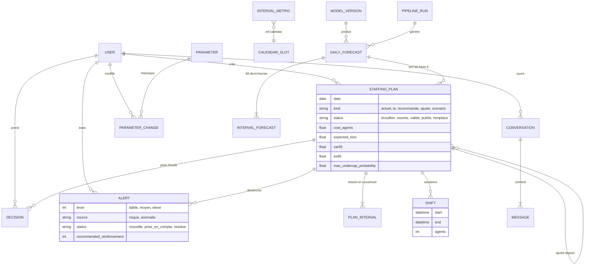
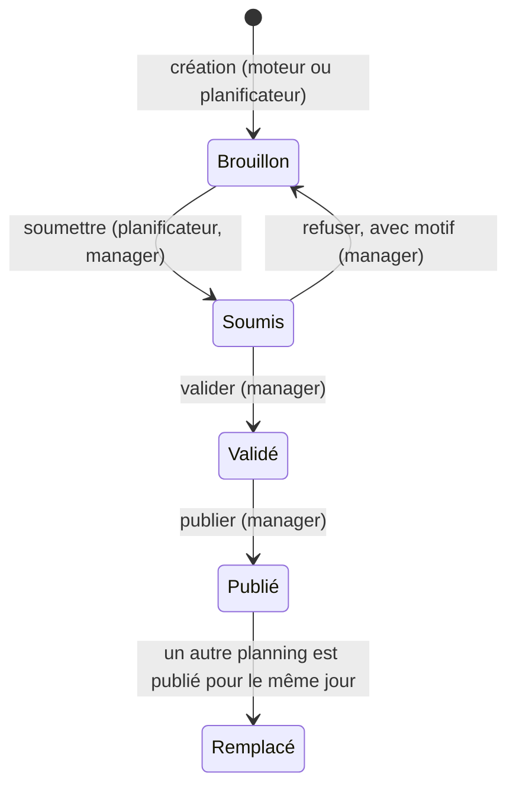

# Modèle de données de l'application

Deux familles de tables cohabitent dans la même base PostgreSQL :

- **le moteur** (schémas `raw`, `core`, `ref`) : historique, calendrier, événements, paramètres ;
- **l'application** (schéma `app`) : ce que la plateforme a prévu, recommandé, décidé.

Les tables du moteur sont lues par Django sans être gérées par lui. Les paramètres
(`ref.cost_parameters`) sont modifiables depuis l'interface et relus par le moteur :
une seule source de vérité.

## Cycle de vie d'un planning

Chaque transition est vérifiée (statut de départ, rôle de l'utilisateur) et enregistrée
dans `Decision`. La base interdit physiquement deux plannings publiés le même jour.
